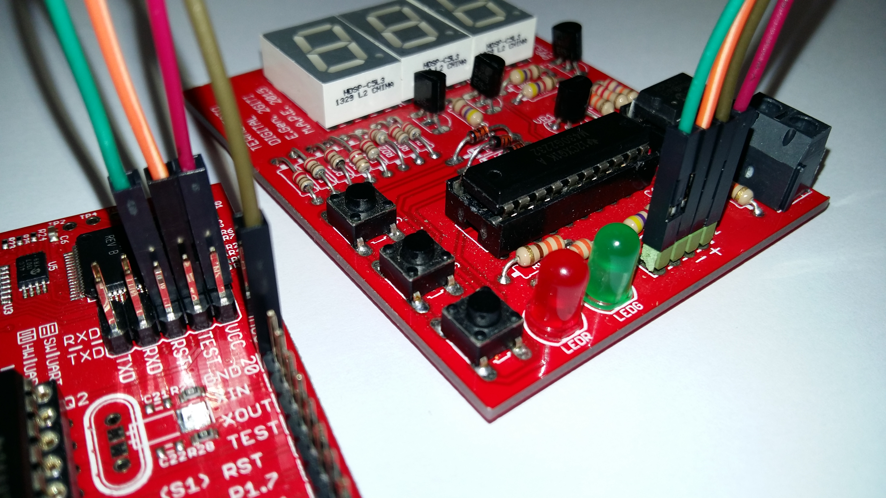

Archivos de ENERGIA.
====================
dado lo justo que va de tamaño el programa final, se recomienda usar la versión 16 (0101E0016) de Energía. 
A partir de la siguiente se han encontrado problemas con el tamaño del código (parece que el compilador no optiimiza tanto). Dado que el código final ocupa 2011 de los 2048 bytes, cualquier cambio puede afectar. 
- - -
## Novedad: 
Se ha optimizado el código y ya cabe, incluso compilado con la versión 17. Finalmente ocupa, eso sí, 2046 de los 2048 bytes disponibles... 
- - -
La conexión entre la placa y un Launchpad G2 se hará con 4 cables hembra-hembra como se muestra en la imagen:

- - -
Para poder programar correctamente la placa, se deben seguir estos pasos:
- Descargar e instalar Energia Versión 16 [ENERGIA](http://energia.nu/download/)
- Copiar el archivo Boards.txt en el directorio \hardware\msp430\ de Energia.
- Cargar y ejecutar el Sketch PBL_CAL.ino. Anotar el offset que muestra la pantalla, y sumarlo a la variable OFFSET al principio del mismo
- Repetir el proceso hasta que el error mostrado sea 00
- Anotar el valor final de la variable OFFSET.
- Cargar el Sketch PBL.ino. En el mismo directorio debe estar el archivo PBL.h
- Modificar el valor de OFFSET según el obtenido en la calibración
- Programar la tarjeta. 
